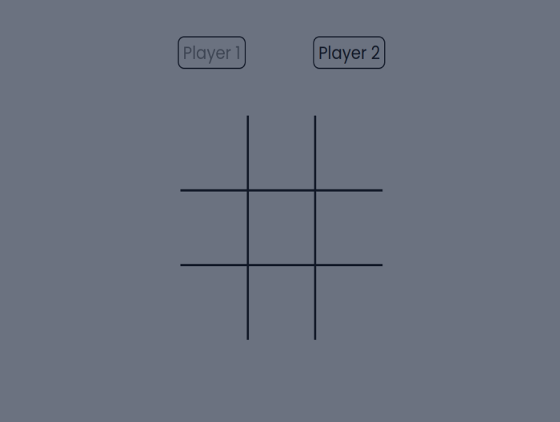

# Tic-tac-toe
## Table of contents

- [Overview](#overview)
  - [About](#about)
  - [Screenshot](#screenshot)
  - [Links](#links)
- [Style Guide](#style-guide)
  - [Layout](#layout)
  - [Colors](#colors)
  - [Typography](#typography)
  - [Icons](#icons)
- [My process](#my-process)
  - [Built with](#built-with)
- [Author](#author)
## Overview
### About

Tic-tac-toe game made with JavaScript.
### Screenshot

### Links

- Live Site URL: [Tic-tac-toe](https://gabrielojorge.github.io/tic-tac-toe).
## Style Guide
### Layout

Responsive layout.
### Colors

- Tailwind shades of gray 400, 500 and 900.
### Typography

- Family: [Poppins](https://fonts.google.com/specimen/Poppins);
- Weight: 400, 600.
## My process
### Built with

- HTML5;
- CSS;
- JavaScript;
- Flexbox;
- Tailwind;
- Mobile-first workflow.
## Author

- Website - [Gabriel O. Jorge](https://gabrielojorge.github.io/Portifolio/).